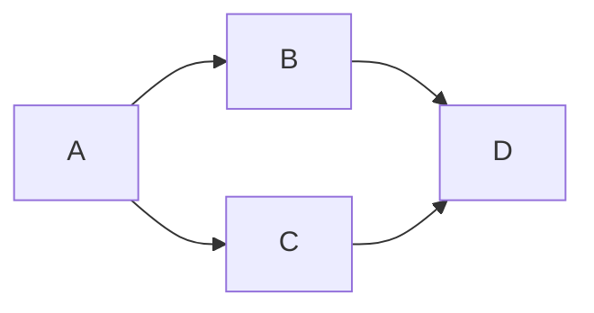

More on mermaid [here](https://mermaid-js.github.io/mermaid/#/)

```geojson
{
  "type": "Feature",
  "geometry": {
    "type": "Point",
    "coordinates": [125.6, 10.1]
  },
  "properties": {
    "name": "Dinagat Islands"
  }
}
```
